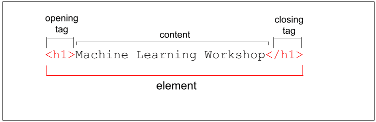
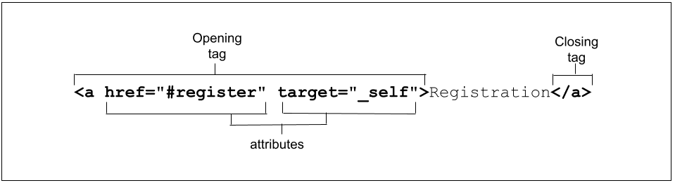

# 1. Overview of HTML

## 1.1 Abstract
本文为[Overview of HTML](https://web.developers.google.cn/learn/html/overview#element_attributes_and_javascript)的学习笔记，归纳整理了HTML(HyperText Markup Language，超文本标记语言)的[Elements](#1.2)(元素)和[Atributes](#1.3)(属性)的相关知识点。

## 1.2 Elements {#1.2}

- HTML elements are delineated by tags, written using angle brackets ('<' and '>').

The closing tag is the same tag as the opening tag, preceded by a slash('/').
- Browsers do not display the tags. The tags are used to interpret the content of the page.
- HTML is very, very forgiving. For example, if we omit the closing &lt;/li&gt; tags, the closing tags are implied.
```HTML
<ul>
  <li>Blendan Smooth
  <li>Hoover Sukhdeep
  <li>Toasty McToastface
</ul>
```
- Although it is valid to not close an &lt;li&gt;, it isn't good practice. ([The specification provides a list of all the required closing tags](https://html.spec.whatwg.org/multipage/syntax.html#syntax-tag-omission)). While it is valid to omit tags, don't. Also, make sure they are correctly nested. Your future self as a maintainer of markup, and anyone else working on your code base, will thank you.
- There are two types of elements: [replaced](#1.2.2) and [non-replaced](#1.2.1).

### Non-replaced elements {#1.2.1}

- Non-replaced elements have opening and (sometimes optional) closing tags that surround them and may include text and other tags as sub-elements. These enclosing tags can turn a phrase or image into a hyperlink(超链接), can make a sentence into a header(标题), can give emphasis(强调) to words, and so on.

### Replaced and void elements {#1.2.2}

#### Replaced elements

- Replaced elements are replaced by objects, be it a graphical user interface (UI) widget in the case of most form controls, or a raster or scalable image file in the case of most images. 
- In this example, the replaced elements &lt;input&gt; are replaced by non-text content: a graphical user interface object.
```HTML
<input type="range">
```
- Output of the above HTML:
<input type="range">

#### Void elements

- Void elements are all self-closing elements and are represented by one tag. This means there is no such thing as a closing tag for a void element.
- Void elements cannot contain text content or nested elements. Void elements include &lt;br&gt;, &lt;col&gt;, &lt;embed&gt;, &lt;hr&gt;, &lt;img&gt;, &lt;input&gt;, &lt;link&gt;, &lt;meta&gt;, &lt;source&gt;, &lt;track&gt;, and &lt;wbr&gt;, among others.
- The video, picture, object, and iframe elements are replaced, but aren't void.
- The base, link, param, and meta elements are void but aren't replaced.

## 1.3 Atributes {#1.3}

- The &lt;input&gt; examples had more than just the element type in it's opening tag. These extra bits of space-separated name/value pairs (though sometimes including a value is optional) are called attributes.
- Attributes only appear in the opening tag. The opening tag always starts with the element type. The type can be followed by zero or more attributes, separated by one or more spaces. Most attribute names are followed by an equal sign equating it with the attribute value, wrapped with opening and closing quotation marks.

- Some attributes are global—meaning they can appear within any element's opening tag. Some apply only to several elements but not all, and others are element-specific, relevant only to a single element.
- Most attributes are name/value pairs. Boolean attributes, whose value is true, false, or the same as the name of the attribute, can be included as just the attribute: the value is not necessary.
- If the value includes a space(空格) or special characters(特殊字符), quotes(用引号括住value) are needed.
- Some attribute values are case-sensitive(大小写敏感). Strings that are not defined as keywords are generally case-sensitive, including id and class values.
- Note that if an attribute value is case-sensitive in HTML, it is case-sensitive when used as part of an attribute selector in CSS and in JavaScript.
- Using lowercase letters for all element names and attribute names within tags and quoting all attribute values are recommended.

<script src="https://giscus.app/client.js"
    data-repo="chenjh726/chenjh726.github.io"
    data-repo-id="R_kgDOMeZntw"
    data-category="General"
    data-category-id="DIC_kwDOMeZnt84ChYwb"
    data-mapping="pathname"
    data-strict="0"
    data-reactions-enabled="1"
    data-emit-metadata="0"
    data-input-position="bottom"
    data-theme="preferred_color_scheme"
    data-lang="zh-CN"
    crossorigin="anonymous"
    async>
</script>